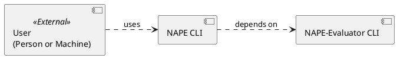

# Installing NAPE

There are three ways you can install NAPE: local build, package manager, or NAPESpaces.

**As of today (Sept. 5, 2024) the only way to install NAPE is via the [local build & install](install-from-source-code.md).  Shortly the other approaches will become available.**

## The NAPE Components

NAPE consists of two specific components.  First, there is the NAPE Command Line Interface (CLI).  Second, there is the NAPE Evaluator CLI. 

- The NAPE CLI, installed as ``$ nape`` is the main tool you will use to executed [NAPE Assurance Procedures](nape-glossary.topic#nape-assurance-procedure).
- The NAPE Evaluator, installed as ``$nape-eval``, is a dependency for the NAPE CLI, and is responsible for the applying the [Test of Details](nape-glossary.topic#test-of-details) to the Evidence identified in the [NAPE Assurance Procedure](nape-glossary.topic#nape-assurance-procedure).

## Ways to Install NAPE

### Build & Install Locally

Build & Install Locally from the [NAPE Source Code](https://github.com/nape-not-another-policy-engine).  This is the pro-version of installing NAPE.  For those used to installing open source locally on their machines, this is a breeze.  All you need to do is simply clone two NAPE repositories and execute a few make commands.

Additionally, you can use this approach to build & deploy your own sets of NAPE binaries for your team.

[Get Started Installing NAPE Locally](install-from-source-code.md)

### **COMING SOON** - Install from a Package Manager

Install from a popular Linux, Mac, or Windows Package Manager.  This is the most common way folks install open source software on their own machines, or within their software delivery tools.

Supported package managers: (To Come)

[Find NAPE for Your Favorite Packaged Manager](install-from-package-manager.md)

### **COMING SOON** - NAPESpaces - No Install Necessary

Use the NAPESpaces Remote Development Environment where everything is installed for you. 

[Click Here to Start Now](no-install-necessary-napespace-remote-development.md)

